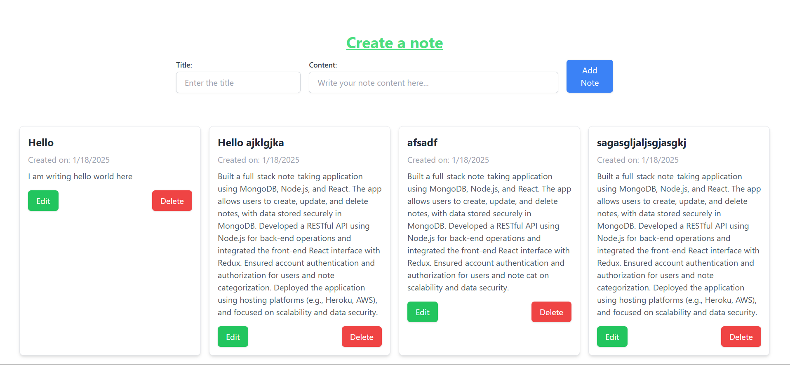

This is a note making web application where users can write, update and delete the note based on their requirements.
All the work are do on the restfull api.
I used this project to learn the MERN and anyone who know how the node, express and mongoose work,  can fetch this repositry and learn from this.

Thank you!!
